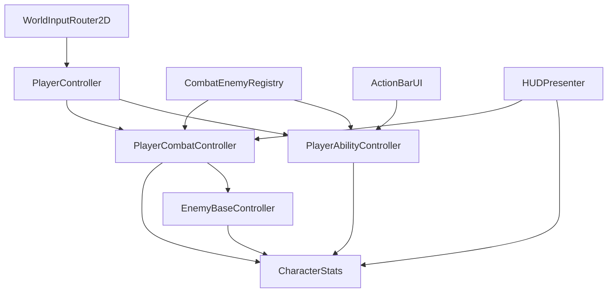

# Systems Map — Desktop Idle RPG Game

**See [`PROJECT__RULES.md`](PROJECT__RULES.md)** for coding constraints that apply to all changes in this project.

Generated from static analysis of `Assets/6.Scripts` (game code). Third-party code under `Assets/ImportedPackages` (e.g. `UniWindowController`) is noted only where it participates in gameplay.

**Scenes:** `Assets/1.Scenes/Bootstrap.unity` (menu / boot), `Assets/1.Scenes/GamePlay.unity` (maps).

---

## 1. Architecture overview

```
Bootstrap scene
  └─ PlayerBootstrapper (spawn persistent player)
  └─ SaveManager, SceneLoader, desktop window shell
  └─ Main menu / slot select UI

GamePlay scene
  └─ GameplayLevelBootstrapper (reads ActiveLevelContext / MapNodeDefinition)
       └─ LevelSpawnDirector (enemies, teleporters, respawn queue)
       └─ SimpleCombatWaveDirector / EnduranceTrialDirector (optional)
  └─ World systems (input router, bounds, camera, biome visuals)
  └─ Player (DDOL from bootstrap): movement, combat, abilities, inventory, stats
  └─ Strip UI + full-window overlay UI
```

**Persistence:** `SaveManager` discovers `ISaveable` components and writes JSON slots via `SaveSlotManager`. Major persisted types: `CharacterStats`, `PlayerCombatController`, `ActionBarUI`, `Inventory`, `PlayerStorage`, `EquipmentManager`, `ToolbeltManager`, `SkillsManager`, `CurrencyWallet`, `QuestProgressManager`, `WorldMapProgressManager`, `StripCameraController`, `Merchant`, `PlayerSave`.

---

## 2. Main gameplay systems

| Domain | Purpose | Key types / locations |
|--------|---------|------------------------|
| **Session & scenes** | Boot, scene transitions, player lifetime | `BootstrapScripts/PlayerBootstrapper`, `SceneLoader`, `PersistAcrossScenes` |
| **Level / map context** | Which map is active, first-visit flags, spawn root | `Gameplay/GameplayLevelBootstrapper`, `WorldMap/ActiveLevelContext`, `MapNodeDefinition` |
| **Spawning** | Enemy/NPC/teleporter placement from map plans | `Gameplay/LevelSpawnDirector`, `SpawnPointGroup`, `SimpleCombatWaveDirector`, `EnduranceTrialDirector` |
| **Player locomotion** | Click-to-move, keyboard, gathering paths, pickups | `Player/PlayerController`, `Player/PlayerSprintInput`, `Player/LaneBounds`, `Gameplay/WorldBounds` |
| **Combat (player)** | Targeting, auto/idle combat, ranged/melee, DPS tracking | `Player/PlayerCombatController` (+ capstone partials), `Player/PlayerCombatState` |
| **Combat (enemies)** | AI states, aggro, attacks, abilities | `NPC/Enemies/EnemyBaseController`, `EnemyAbilityController`, `EnemyAggro` |
| **Shared combat** | Ailments, projectiles, enemy registry, mitigation | `SharedCombat/*`, `CombatEnemyRegistry`, `AilmentController` |
| **Abilities** | Cooldowns, channels, minions, VFX orchestration | `Abilites/PlayerAbilityController` (many partials), `PlayerAbilityVfxController`, `ActionBarUI` — **new abilities:** [`NEW_SKILL_ENTRY_AGENT_CHECKLIST.md`](NEW_SKILL_ENTRY_AGENT_CHECKLIST.md) |
| **Skills / progression** | XP, skill trees, ability row picks | `Skills/SkillsManager`, skill-tree UI scaffolds |
| **Stats** | HP/energy/mana/guard, gear-derived stats, combat power | `Player/CharacterStats` |
| **Equipment** | Gear slots, weapon sets, visual equippers | `Equipment/EquipmentManager`, `ToolbeltManager`, `*Equipper.cs` |
| **Inventory & storage** | Bags, sorting, drag-drop, tooltips | `Inventory/*` |
| **Gathering** | Resource nodes (wood/mining/fishing) | `Gathering/ResourcesNodes/ResourceNode`, `ClickResource` |
| **Loot** | World drops, pickup | `Items/DropManager`, `Items/ItemDrop` |
| **Economy** | Gold, shops, sale undo | `Economy/CurrencyWallet`, `NPC/Merchant/*`, `SaleUndoManager` |
| **Quests** | Objectives, tracking, givers | `Quest/QuestProgressManager`, `QuestGiver`, `QuestTrackerWindowUI` |
| **World map UI** | Region/node select, travel, scaling | `WorldMap/WorldMapProgressManager`, `LevelSelectListViewUI`, `WorldMapPageUI` |
| **NPC / dialogue** | Merchants, healers, typewriter dialogue | `NPC/NPCDialogueBoxUI`, `NPCInteractionSettings`, `ShopUI` |
| **Minions** | Soulforged weapon/warrior summons | `Minions/*` |
| **Desktop shell** | Transparent strip window, monitor switch, click-through | `DesktopWindow/*`, `ImportedPackages/.../UniWindowController` |
| **Tutorial / helpers** | Modal helper overlays, whitelist routing | `UI/Helpers/HelperGameplayController` |
| **Input routing** | World clicks vs UI, hover highlight | `Common/WorldInputRouter2D`, `WorldInteractRouter`, `HoverPicker2D` |
| **Save / load** | Autosave, debounced saves, apply on load | `SaveLoad/SaveManager`, `SaveSlotManager`, `PlayerSave` |

---

## 3. Important managers & controllers

### Singletons / static hubs

| Script | Role |
|--------|------|
| `SaveManager` | Autosave, debounced inventory/storage saves, load apply, scene-transition saves |
| `SaveSlotManager` | Slot index, spawn disposition (new game / load / portal) |
| `SkillsManager` | Skill levels, tree choices, ability row picks (`ISaveable`) |
| `QuestProgressManager` | Quest state (`ISaveable`, DDOL) |
| `WorldMapProgressManager` | Node unlock/visit, endurance tiers (`ISaveable`) |
| `DropManager` | Central world-drop spawning |
| `HotkeyBindingManager` | Rebindable hotkeys |
| `SaleUndoManager` | Shop sale undo stack |
| `GameplayLevelBootstrapper` | Per-map session start event |
| `CombatEnemyRegistry` | Live enemy list (avoids repeated scene scans) |
| `CombatPlayerRefs` | Lazy-cached player/wallet/popup refs |
| `PlayerTransformCache` | Cached player transform |
| `UIWindowManager` | Open window stack / focus |
| `SceneLoader` | Thin scene load wrapper |
| `FramerateCapController` | Static FPS cap helper |

### Scene / gameplay directors

| Script | Role |
|--------|------|
| `LevelSpawnDirector` | Spawns enemies & in-map teleporters from `MapNodeDefinition` |
| `SimpleCombatWaveDirector` | Wave-based combat sequences |
| `EnduranceTrialDirector` | Endurance trial flow |
| `SidePlayAreaDirector` | Side play-area layout |
| `PlayerSpawnController` | Snap player to spawn points / saved positions |
| `StripCameraController` | Strip camera zoom & bounds (`ISaveable`) |
| `CameraFollow` | Follow player in world strip |
| `LevelBiomeVisualsController` | Biome/sky presentation per map |

### Player-facing controllers (on player prefab)

| Script | Role |
|--------|------|
| `PlayerController` | Movement state machine, gathering, interaction |
| `PlayerCombatController` | Combat targeting, attacks, idle combat |
| `PlayerAbilityController` | All player abilities (partial class split across files) |
| `PlayerBuffController` | Consumable / ability buff HUD sync |
| `PlayerConsumableController` | Consumable use |
| `CharacterStats` | Vitals, derived stats, damage formulas |
| `EquipmentManager` / `ToolbeltManager` | Gear & tools |
| `Inventory` | Player bag |
| `ActionBarUI` | Hotbar assignments & input |

### Presentation / UI coordinators

| Script | Role |
|--------|------|
| `HUDPresenter` | Binds HUD to player stats/combat |
| `HelperGameplayController` | Tutorial/helper modals, movement lock, whitelist |
| `OffscreenMarkersController` | Edge markers for off-screen targets |
| `DamagePopupSystem` | Floating combat numbers |
| `GoldPopupSpawner` | Gold/XP popups |
| `EnemyOverheadSpawner` | Player overhead HP bar instance |

---

## 4. Per-frame scripts (`Update` / `LateUpdate` / `FixedUpdate`)

**Scope:** `Assets/6.Scripts` only — **103 scripts** define at least one of these methods.

### Gameplay / combat / movement (high impact)

| Script | Methods | Notes |
|--------|---------|-------|
| `PlayerController` | `Update` | Movement FSM, regen, sprint poll, click-to-move |
| `PlayerCombatController` | `Update` | Idle combat, auto abilities/consumables, melee range |
| `PlayerAbilityController` | `Update`, `LateUpdate` | Active channels tick every frame; idle maintenance throttled |
| `PlayerBuffController` | `Update` | Buff timers |
| `CharacterStats` | `Update`, `LateUpdate` | Shadow Hunter expiry; coalesced `OnStatsChanged` |
| `EnemyBaseController` | `Update`, `FixedUpdate` | **Per-enemy** AI + physics chase |
| `MinionUnit` | `Update` | Minion behavior |
| `MinionCombatController` | `Update`, `LateUpdate` | Minion combat |
| `SoulforgedWeaponMinion` / `SoulforgedWarriorMinion` | `Update` | Summon logic |
| `ResourceNode` | `Update` | Depletion regen, name-label overlap |
| `ProjectileVisual` + element variants | `Update` | Projectile motion |
| `WorldInputRouter2D` | `Update` | Hover + world click routing |
| `HoverPicker2D` | `Update` | Fallback hover (deferred when router active) |
| `SimpleCombatWaveDirector` | `Update` | Wave timing |
| `InMapTeleporter` / `MapNodePortalTeleporter` | `Update` | Proximity / interact |
| `QuestGiver` | `Update` | Proximity markers |
| `QuestProgressManager` | `Update`, `LateUpdate` | Objective polling / deferred UI |
| `CloudLayerDrift` | `Update` | Parallax |
| `LevelBiomeVisualsController` | `Update` | Biome transitions |
| `CameraFollow` | `LateUpdate` | Camera follow |
| `WorldBounds` | `LateUpdate` | Lane bounds cache |
| `PlayerSprintInput` | `LateUpdate` | Dash cooldown presentation |
| `WeaponSetSwapInput` | `Update` | Weapon set hotkeys |
| `PlayerLevelTransition` | `LateUpdate` | Map transition fade |
| `LaneBounds` | `LateUpdate` | Lane clamp helpers |
| `SidePlayArea` | `LateUpdate` | Side area layout |
| `WorldFloorToUIEdge` | `LateUpdate` | World/UI floor alignment |
| `FacePlayerSpriteFlip` | `LateUpdate` | Sprite facing |

### UI / desktop (strip & overlay)

| Script | Methods |
|--------|---------|
| `HUDPresenter` | `Update` |
| `HUDView` | `LateUpdate` |
| `ActionBarUI` | `Update` |
| `ActionBarSlotUI` | `Update` |
| `BuffsDebuffsPanel` | `Update` |
| `UnitOverheadUI` | `LateUpdate` |
| `DamagePopupSystem` | `LateUpdate` |
| `EnemyOverheadSpawner` | `Update` |
| `OffscreenMarkersController` | `LateUpdate` |
| `HelperGameplayController` | `Update`, `LateUpdate` |
| `MainMenuWindowUI` / tabs | `LateUpdate` |
| `TrackerWindowUI` | `Update`, `LateUpdate` |
| `QuestTrackerWindowUI` | `LateUpdate` |
| `SkillTreeViewUI` | `Update` |
| `SharedToolTipUI` | `LateUpdate` |
| `ContextMenuUI` | `LateUpdate` |
| `StripCameraController` | `Update` |
| `DesktopOverlayClickThrough` | `LateUpdate` |
| `FullWindowBackgroundPresenter` | `LateUpdate` |
| `MonitorSwitcher` | `Update` |
| `UIWindowManager` | `Update` |
| `SaveSlotMenuUI` | `Update`, `LateUpdate` |
| `NPCDialogueBoxUI` | `Update`, `LateUpdate` |
| `StorageGridUI` / `EquipmentSlotUI` | `Update` |
| `InventoryToggleUI` | `Update` |
| `FpsDisplayText` / `DpsBreakdownTrackerUI` | `Update` |
| `SessionTrackerData` | `Update` |
| `MovePivotsModeController` | `Update` |
| …plus layout followers (`FollowRectTransform`, `FlipInsideBounds`, `XPBarUI`, etc.) |

### Systems / debug

| Script | Methods | Notes |
|--------|---------|-------|
| `SaveManager` | `Update` | Autosave timer, debounced save flush |
| `PlayerSave` | `Update` | Applies pending vitals/name/position after load |
| `DebugPerformanceToggles` | `Update` | Dev F-key overlays (Editor-oriented) |
| `UIRaycastProbe` | `Update` | Debug UI hit logging |
| `WorldHoverCursor2D` | `Update` | Custom cursor |
| `EnvenomSpreadOnDeathMarker` | `Update` | Death-triggered ailment spread |

### Scaling note

`EnemyBaseController` runs **`Update` + `FixedUpdate` per live enemy**. Enemy count is the primary multiplicative CPU factor in combat maps.

---

## 5. Instantiate / Destroy usage

### Runtime gameplay spawning (combat / world)

| Script | Pattern |
|--------|---------|
| `LevelSpawnDirector` | `Instantiate` enemies, teleporters from map plans |
| `PlayerBootstrapper` | `Instantiate` player prefab (DDOL) |
| `DropManager` | `Instantiate` `ItemDrop` world pickups |
| `PlayerController` | `Instantiate` world drops on death/overflow |
| `PlayerCombatController` | `Instantiate` ranged/magic projectiles |
| `PlayerAbilityController` | `Instantiate` minions, spectral axe, projectiles; `Destroy` on expiry |
| `MinionUnit` | `Instantiate` soldier visual child |
| `QuestGiver` | `Instantiate` exclamation mark |
| `NPCInteractionSettings` | Runtime NPC UI pieces |
| `ProjectileVisual` / `FireBallProjectileVisual` / `IceShardProjectileVisual` / `EnergyBoltVisual` | Self-`Destroy` on impact |
| `ItemDrop` | `Destroy` after pickup or lifetime |
| `EnemyBaseController` | `Destroy` on death |
| `SoulforgedWarriorMinion` | `CancelAndDestroy` / `ExpireImmediately` |

### UI / feedback spawning

| Script | Pattern |
|--------|---------|
| `GoldPopupSpawner` | `Instantiate` gold/XP popups |
| `DamagePopupSystem` / `FloatingDamageTextUI` | Damage number pool |
| `EnemyOverheadSpawner` / `UnitOverheadUI` | Overhead bars & debuff icons |
| `BuffsDebuffsPanel` | Buff/debuff icon rows |
| `ContextMenuUI` | Dynamic context menu buttons |
| `InventoryGridUI` / `StorageGridUI` / `UpgradeInventoryGridUI` | Slot prefabs |
| `QuestTrackerWindowUI` | Tracker rows |
| `WorldMapPageUI` / `LevelSelectListViewUI` | Map node/connector rows |
| `SkillTreeViewUI` / `HorizontalSkillTreeScaffoldUI` / `SkillChoiceGroupUI` | Tree nodes & connectors |
| `DatabasePageUI` | Codex list rows |
| `UpgradePageUI` | Upgrade list entries |
| `NPCDialogueBoxUI` | Dialogue box clones |
| `HelperGameplayController` | Helper glow shells |
| `FullWindowBackgroundPresenter` | Full-window sky clone |
| `OffscreenMarkersController` | Marker widgets (reuse + spawn) |

### Teardown / lifecycle

Most managers use `Destroy(gameObject)` on duplicate singleton (`QuestProgressManager`, `WorldMapProgressManager`, `SaleUndoManager`). `SaveManager` may destroy duplicate `EventSystem` or fader objects during load recovery.

**Editor-only instantiate:** `Editor/*`, `MovePivotsSettingsInstaller`, `HotkeySettingsPanelUI` template cloning.

---

## 6. `FindObjectOfType` / `FindObjectsByType` / `FindFirstObjectByType`

Heavy users (startup, rebind, or infrequent — **not** generally per-frame):

| Script | Count (approx.) | Typical use |
|--------|-----------------|-------------|
| `SaveManager` | 28 | Gather `ISaveable`, find player on load |
| `QuestProgressManager` | 30 | Quest target resolution across scenes |
| `HelperGameplayController` | 20 | UI/world wiring for tutorials |
| `DevTestingPanelUI` | 15 | Debug cheat panel |
| `ActionBarSlotUI` | 11 | Lazy ref resolve |
| `InventorySlotUI` / `StorageSlotUI` | 11–12 | Tooltip/inventory refs |
| `PlayerAbilityController` | 10 | Action bar, minion reclaim |
| `ActionBarUI` | 10 | Multi-bar dedupe, ref resolve |
| `NPCInteractionSettings` | 9 | NPC UI hooks |
| `EquipmentSlotUI` | 9 | Equipment UI refs |
| `SkillsAbilityPageUI` | 8 | Page cross-refs |
| `EnduranceTrialDirector` | 8 | Trial scene hooks |

**Static lazy caches (good pattern):** `CombatPlayerRefs`, `CombatEnemyRegistry`, `PlayerTransformCache`.

**`Resources.FindObjectsOfTypeAll` (expensive, includes assets):** `MainMenuWindowUI`, `MainMenuTabButtonAutoWire`, `QuickMenuPanelToggleUI`, `ActivityWindowToggleUI`, `InventoryToggleUI`, `GameLogWindowUI`, `ActionBarUI` (ItemDatabase fallback).

### In `Update` / `LateUpdate` / `FixedUpdate` bodies

| Script | Method | Issue |
|--------|--------|-------|
| `Gathering/ResourcesNodes/ResourceNode` | `Update` | `FindFirstObjectByType<PlayerController>` until `_player` cached |
| `DesktopWindow/DesktopOverlayClickThrough` | `LateUpdate` | `FindFirstObjectByType<UniWindowController>` if `uniWin` null |

All other per-frame scripts avoid scene-wide finds in their tick methods (per automated body extraction).

---

## 7. `GetComponent` in per-frame methods

| Script | Method | Pattern |
|--------|--------|---------|
| `Player/PlayerCombatController` | `Update` | `GetComponent<Collider2D>()` on target when collider cache invalid |
| `SaveLoad/PlayerSave` | `Update` | `GetComponent<CharacterStats>()` while applying pending load vitals |
| `Gameplay/WorldBounds` | `LateUpdate` | `GetComponent<BoxCollider2D>()` if reference lost |
| `Common/HoverPicker2D` | `Update` | `GetComponentInParent<SimpleHoverHighlight2D>()` on picked collider |
| `Common/UIRaycastProbe` | `Update` | `GetComponentInParent<Canvas>()` in debug raycast log |

`ActionBarUI.Update` calls `GetComponent` only inside `IsTypingIntoInputField()` when a UI field is selected (not every frame in practice).

---

## 8. LINQ in per-frame methods

**None detected** in `Update` / `LateUpdate` / `FixedUpdate` bodies under `Assets/6.Scripts`.

LINQ appears in save/load (`SaveManager.FindSaveables`), editor tools, and occasional UI build paths — not in hot loops.

---

## 9. Tag scans & `GameObject.Find`

### `CompareTag` / `FindWithTag` (runtime)

| Script | Usage |
|--------|-------|
| `Common/WorldInteractRouter` | `CompareTag("NoticeBoard")` |
| `WorldMap/MapNodeInteractablesPreview` | Notice board tag filter |
| `NPC/Enemies/EnemyAggro` | `attacker.CompareTag("Player")` |
| `NPC/Enemies/EnemyBaseController` | Player tag check |
| `UI/EnemyOverheadSpawner` | Canvas tag/name match |
| `NPC/NPCDialogueBoxUI` | `UICanvas` tag |
| `UI/MovePivotsModeController` | `FindWithTag("FullWindowCanvas")` |
| `UI/UIWindowLayoutBinding` | `FindWithTag("FullWindowCanvas")` |

**Not in per-frame methods** (tag scans in Update: **none**).

### `GameObject.Find` by name (brittle / scene-dependent)

| Script | Names searched |
|--------|----------------|
| `Player/PlayerController` | `StripCamera`, `FullCamera` |
| `Player/PlayerSpawnController` | `SpawnPoint_*` variants |
| `Gameplay/PlayAreaBounds` | `SpawnPoint_Player` |
| `Gameplay/WorldFloorToUIEdge` | `WorldVisuals` |
| `Gameplay/LaneGroundEffectPlacement` | Lane child |
| `Common/WorldHoverCursor2D` | `StripCamera` |
| `UI/Helpers/HelperGameplayController` | `StripCamera` |
| `UI/MovePivotsModeController` | `QuickMenuPanel`, `WindowsArea`, `FullWindowCanvas` |
| `UI/UIWindowLayoutBinding` / `UIWindowLockStore` | `WindowsArea`, `FullWindowCanvas` |
| `Economy/GoldPopupSpawner` | Top popup canvas |
| `UI/ContextMenuUI` | Fullscreen canvas |
| `UI/BuffsDebuffsPanel` | `HUDToolTipInfoPanel` |
| `NPC/NPCDialogueBoxUI` | `BotomGameBar` |
| `SaveLoad/SaveManager` | `DeathRespawnFader` |
| `SaveLoad/SaveSlotMenuUI` | Save card objects |

---

## 10. UI-only systems

These affect presentation, menus, or layout only (no direct combat/movement simulation):

- **HUD strip:** `HUDPresenter`, `HUDView`, `XPBarUI`, `BuffsDebuffsPanel`, `EnduranceWaveHUD`, `StripZoomHudText`, `ActiveMapDisplayUI`, `FpsDisplayText`
- **Windows chrome:** `UIWindowManager`, `UIDragWindow`, `UIWindowFocus`, `UIWindowCornerResize`, `UIWindowLayoutBinding`, `UIWindowPositionMemory`, `MovePivotsModeController`, `WindowPivotGhostUI`
- **Main menu / pages:** `MainMenuWindowUI`, `SkillsAbilityPageUI`, `SkillsAbilityPageNewUI`, `UpgradePageUI`, `DatabasePageUI`, `QuestPageUI`, settings rows
- **Inventory / equipment UI:** `InventoryGridUI`, `StorageGridUI`, `EquipmentStatsPanelUI`, `EquipmentSlotUI`, `SharedToolTipUI`, shop/undo UIs
- **Skill tree UI:** `SkillTreeViewUI`, `HorizontalSkillTreeScaffoldUI`, `SkillNodeDetailsPanelUI`, timeline scaffolds
- **World map UI:** `LevelSelectListViewUI`, `WorldMapPageUI`, `MapAreaDetailsPanelUI`, `MapCombatScalingPopupUI`
- **Quest UI:** `QuestTrackerWindowUI`
- **Dialogue UI:** `NPCDialogueBoxUI`
- **Desktop presentation:** `StripCameraController`, `FullWindowBackgroundPresenter`, `DesktopOverlayClickThrough`, `RightEdgeResizer`, `DragStripBar`
- **Overlays:** `DamagePopupSystem`, `FloatingDamageTextUI`, `GoldPopupSpawner`, `EnhancementFlashUI`, `LevelLoadScreenUI`, `DeathRespawnPopupUI`
- **Tutorial UI:** `HelperGameplayController`, `HelperPopupWindow`
- **Debug UI:** `DevTestingPanelUI`, `BugAndSuggestionReportUI`, `DebugPerformanceToggles`

**Bridge components (UI ↔ gameplay):** `HUDPresenter`, `ActionBarUI`, `ToggleIdleCombat`, `EnemyOverheadSpawner`, `OffscreenMarkersController` — UI layer but driven by combat/world state.

---

## 11. Combat & movement systems

### Movement

- `PlayerController` — primary FSM (`Idle`, `MoveToTarget`, `MoveToPoint`, `Gather`, `MoveToPickup`)
- `PlayerSprintInput` — sprint/dash
- `WeaponSetSwapInput` — weapon set hotkeys
- `WorldBounds` / `LaneBounds` / `PlayAreaBounds` — world limits
- `CameraFollow` + `StripCameraController` — view
- `WorldInputRouter2D` — click picking → player commands
- `PlayerLevelTransition` — map travel

### Combat

- `PlayerCombatController` — player attacks, idle combat, retaliation, projectiles
- `PlayerAbilityController` — skills (melee channels, ranged, summons, banners, gathering abilities)
- `CharacterStats` — damage, mitigation, attack speed, combat power
- `AilmentController` / `AilmentPayloads` — DoTs, stuns, etc.
- `PlayerBuffController` — temporary combat buffs
- `EnemyBaseController` + `EnemyAbilityController` — enemy loop
- `CombatEnemyRegistry` — enemy enumeration for AOEs/targeting
- `MinionCombatController` / `MinionUnit` / Soulforged minions
- `DropManager` / combat loot hooks
- `DamagePopupSystem` / `DpsBreakdownTrackerUI` — feedback (UI but combat-driven)

### Spawning & waves

- `LevelSpawnDirector`, `SimpleCombatWaveDirector`, `EnduranceTrialDirector`, `TutorialRogueReinforcementSpawner`

---

## 12. Known risky scripts (performance)

Priority ordered — largest practical impact first.

| Risk | Script | Why |
|------|--------|-----|
| **Critical size / complexity** | `Player/CharacterStats.cs` (~5.6k lines) | Central stat hub; many derived properties; `LateUpdate` event fan-out |
| **Critical size / complexity** | `Abilites/PlayerAbilityController.cs` (+ partials, ~9k+ lines total) | Heavy `Update` when any channel/buff active; instantiates minions/projectiles |
| **Critical size** | `Player/PlayerController.cs` (~5.2k lines) | Every-frame movement FSM + regen |
| **Critical size** | `UI/Helpers/HelperGameplayController.cs` (~4.9k lines) | `Update`+`LateUpdate`; many scene finds at setup; layout saves |
| **Per-enemy multiplier** | `NPC/Enemies/EnemyBaseController` | `Update` + `FixedUpdate` × enemy count |
| **Per-frame UI** | `Abilites/ActionBarUI` | Polls all slots; periodic `ResolveCoreRefs()` |
| **Per-frame UI** | `SharedCombat/UnitOverheadUI` | Large script; `LateUpdate` positioning per unit |
| **Per-frame UI** | `UI/OffscreenMarkersController` | `LateUpdate` aggregation across registries |
| **Scene scan** | `Abilites/PlayerAbilityVfxController` | `FindObjectsByType<ResourceNode>` on interval for woodcut outlines |
| **Lazy find in Update** | `Gathering/ResourcesNodes/ResourceNode` | Player find until cached (once per node) |
| **Find in LateUpdate** | `DesktopWindow/DesktopOverlayClickThrough` | `UniWindowController` lookup if unset |
| **GetComponent in Update** | `Player/PlayerCombatController` | Target collider cache refresh |
| **Save spikes** | `SaveLoad/SaveManager` | `FindObjectsByType` + LINQ when saving; `Update` autosave |
| **Heavy UI rebuild** | `Skills/SkillTreeViewUI`, `WorldMap/WorldMapPageUI` | Large instantiate/destroy on open/refresh |
| **Expensive global search** | `UI/MainMenuWindowUI` | `Resources.FindObjectsOfTypeAll<Transform>()` for tab wiring |
| **Debug** | `Common/UIRaycastProbe` | Per-frame `RaycastAll` + string build |
| **Many Find calls** | `Quest/QuestProgressManager` | Quest object resolution (mostly event-driven, not per-frame) |

### Mitigations already present

- `CombatEnemyRegistry` instead of repeated `FindObjectsByType<EnemyBaseController>`
- `PlayerAbilityController.RequiresPerFrameAbilityRuntimeWork()` throttles idle ability maintenance
- `CharacterStats.NotifyStatsChanged` coalesces to `LateUpdate`
- `OffscreenMarkersController` uses refresh intervals + `Profiler.BeginSample`
- `InventoryUiRefreshCoordinator` coalesces grid rebuilds
- `ActionBarUI` throttles slot visual refresh (`slotRuntimeRefreshInterval`)

### Dev tooling

`Debug/DebugPerformanceToggles` (F6–F12) can disable overhead UI, floating combat text, action bar, parallax, etc., for profiling.

---

## 13. Folder reference (`Assets/6.Scripts`)

| Folder | Contents |
|--------|----------|
| `Abilites/` | Action bar, ability execution, VFX controller |
| `BootstrapScripts/` | Player spawn, scene load, boot binders |
| `Common/` | Input routing, UI window core, hover, caches |
| `DesktopWindow/` | Strip/full window shell |
| `Economy/` | Currency, shops, sale undo, popups |
| `Equipment/` | Gear managers, slot UI, equippers |
| `Gameplay/` | Level bootstrap, spawning, camera, bounds, trials |
| `Gathering/` | Resource nodes |
| `Input/` | Hotkey chords & binding manager |
| `Inventory/` | Bags, storage, grids, tooltips |
| `Items/` | Item defs, drops, enhancement |
| `Minions/` | Summoned units |
| `NPC/` | Dialogue, merchants, enemies |
| `Player/` | Controller, combat, stats, capstones |
| `Quest/` | Quest manager, givers, UI |
| `SaveLoad/` | Save manager, data types, slot UI |
| `SharedCombat/` | Ailments, projectiles, overhead UI, registries |
| `Skills/` | Skills manager, databases, tree UI |
| `UI/` | Menus, HUD, settings, trackers, helpers |
| `WorldMap/` | Map progress, travel, node definitions |
| `Editor/` | Inspectors & setup menus (not shipped gameplay) |
| `Debug/` | Performance toggles |

---

## 14. Quick dependency graph (combat tick)



---

*Document produced by static analysis. Re-run searches on `Assets/6.Scripts` after major refactors to keep sections 4–9 accurate.*
